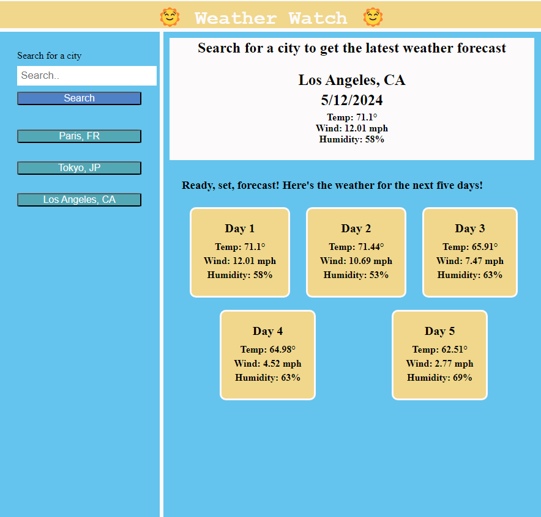

# Weather Watch

## Weather Watch provides users with current and future weather conditions for cities worldwide!

- Users can search for a city to view its current weather conditions along with a 5-day forecast. Additionally, the application keeps track of the user's search history for easy access to previously searched cities.

## User Interface

- Users can search for any city to view its current and future weather conditions.

- Upon searching for a city, users are presented with the current weather conditions, including the city name, date, temperature, humidity, and wind speed.

- Alongside the current weather, users can view a 5-day forecast for the searched city, displaying the date, temperature, humidity, and wind speed for each day.

- The application maintains a search history, allowing users to quickly access the weather conditions for previously searched cities.

- Users can click on a city in the search history to instantly view its current and future weather conditions.

## Technologies Used

- HTML/CSS for structuring and styling.

- JavaScript for the interactive elements and managing localStorage.

- OpenWeather API to fetch weather data for cities.

## Usage

[Link to Deployed Website](https://girlnotfound.github.io/Weather-Watch/)

## Collaborators

This project was made possible with the help of:

[Jordan Gonzales](https://github.com/JordanGWiz)

[Adam Rosenberg](https://github.com/AcoderRose)

[Ryan Petersen](https://github.com/RyanPetersen-89)
